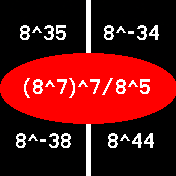

# QuickMath (only Bangle.js 2)

Quickmath - Practice your math skills!

> Here the 10 types of challenges:

## Usage

1. Download the app on my [personal app loader](https://ilingu.github.io/BangleAppLoader/)
2. Launch the app and you will see a menu
3. Choose your difficulty (Easy<Medium<Hard)
4. Then choose a problem type between Algebra,Equations,Arithmetics (or random)
5. Choose a exercise type (see above pictures) or random
6. Have fun! since each question are randomly generated, some might be broken

## Controls

In this game button are useless, all the controls is done via the touchscreen

You can slide the screen to move right or left the quaestion prompt, and then validate your answer by clicking on it.

A "result screen" will show up for 15s with the answer if you're wrong or the score if you're right, if you want to skip it, just tap the screen whenever it show up.

## Creator/Requests/Contact

MIT - [@Ilingu](https://github.com/Ilingu)
📧 Email: [ilingu@duck.com](mailto:ilingu@duck.com)
